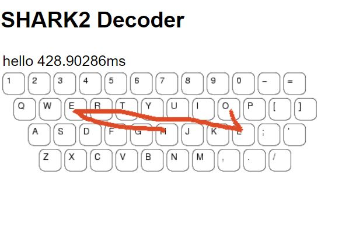

# gestureType
Proof of concept Flask webapp of gesture typing (like on phones) using SHARK2 algorithm

## Experience

The user enters the webpage and sees a keyboard image on the website. They can use gesture typing by dragging across letters. The 
word they typed will appear on the top.

# Technical
## Views (single page)
- Home 

## Routes
- /
  - GET home.html
- /shark2/
  - algorithm to return the best word given the coordinates that were typed

## Features
- Drawing on the keyboard
- Word appears after a few seconds

## Languages

#### Front-End
* HTML
* CSS
* JavaScript

#### Back-End
* Flask
* Algorithm implemented with Python
  
  
